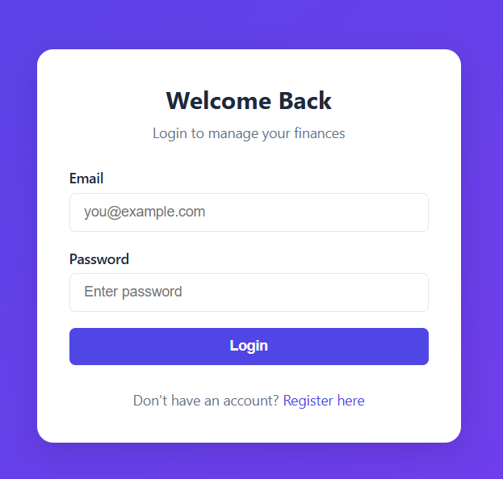
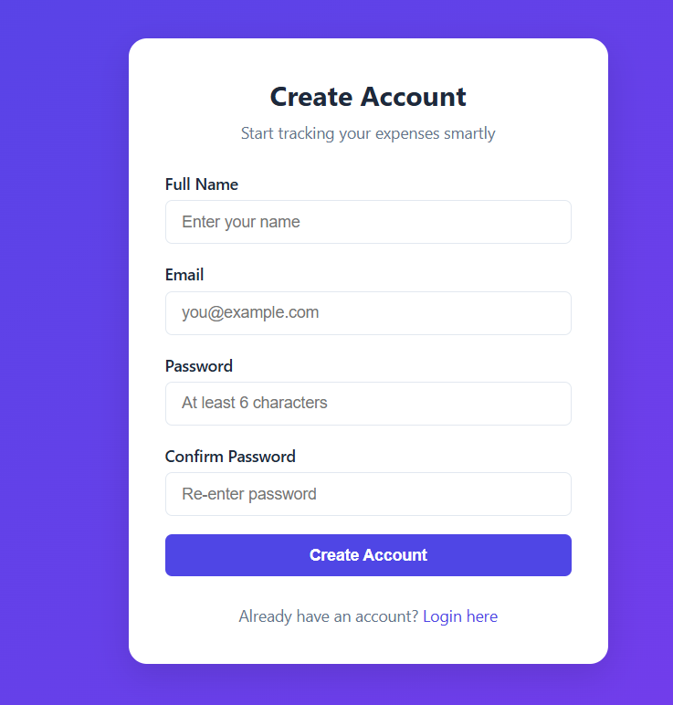
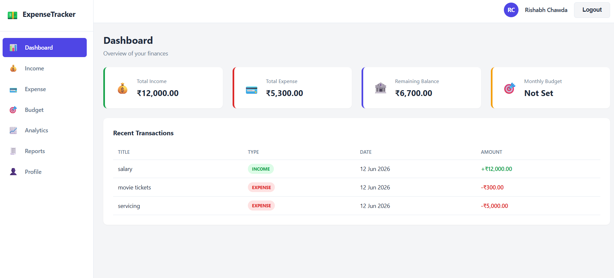
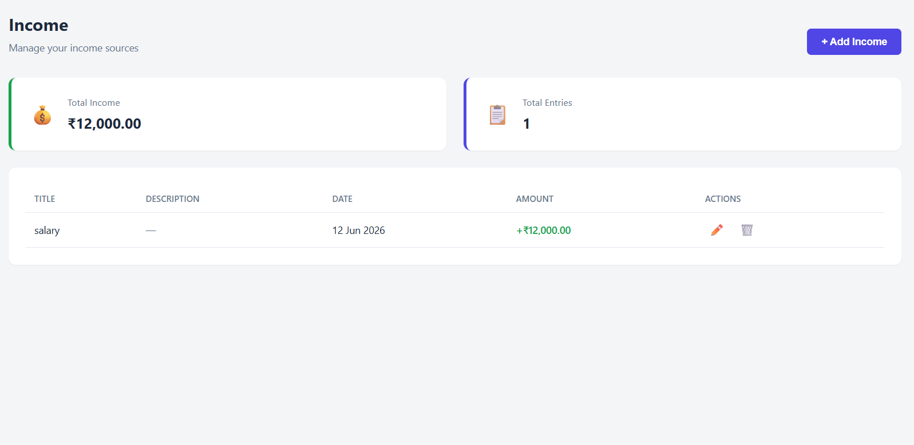
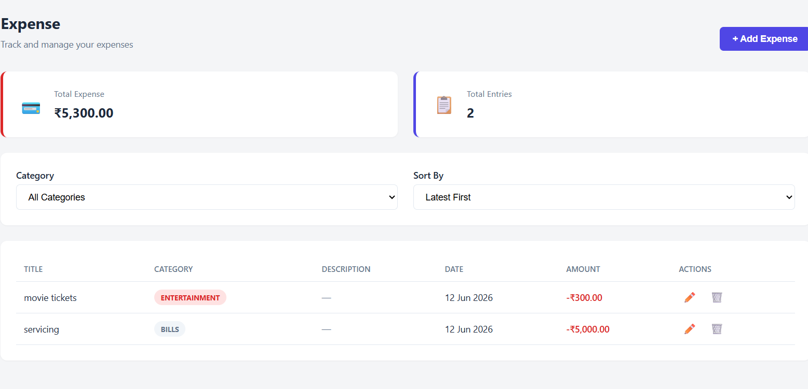
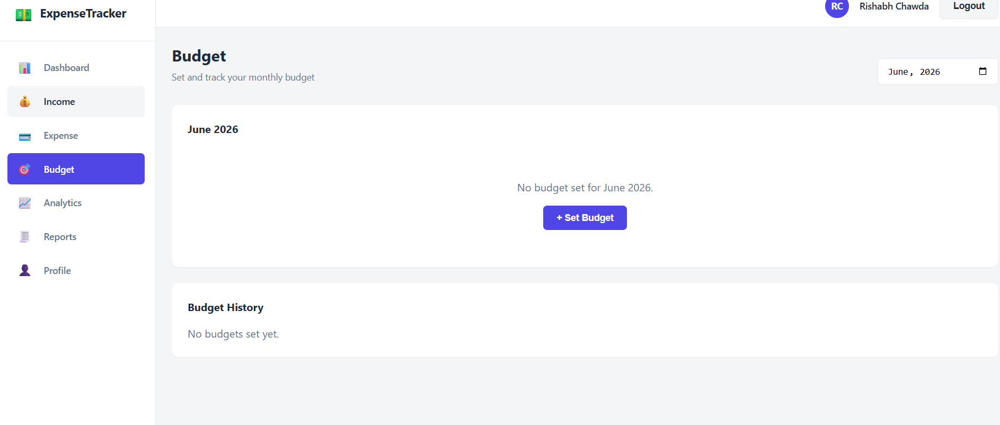
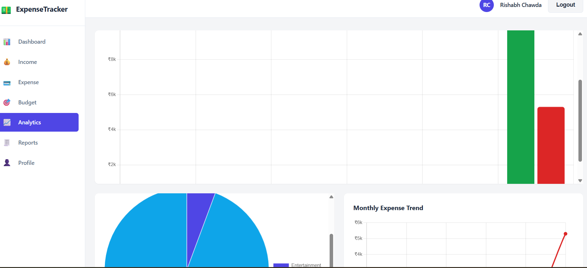
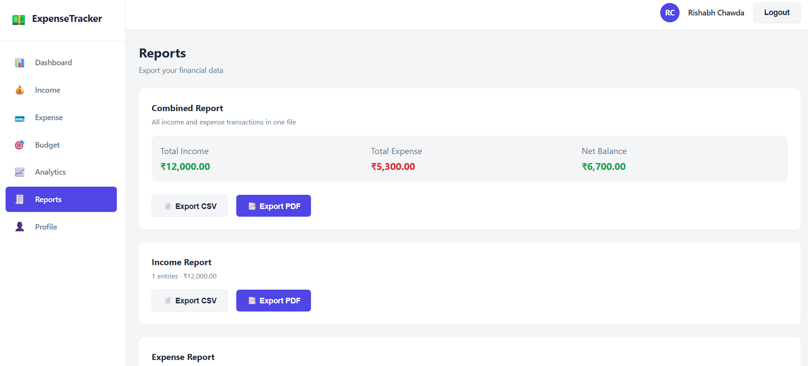
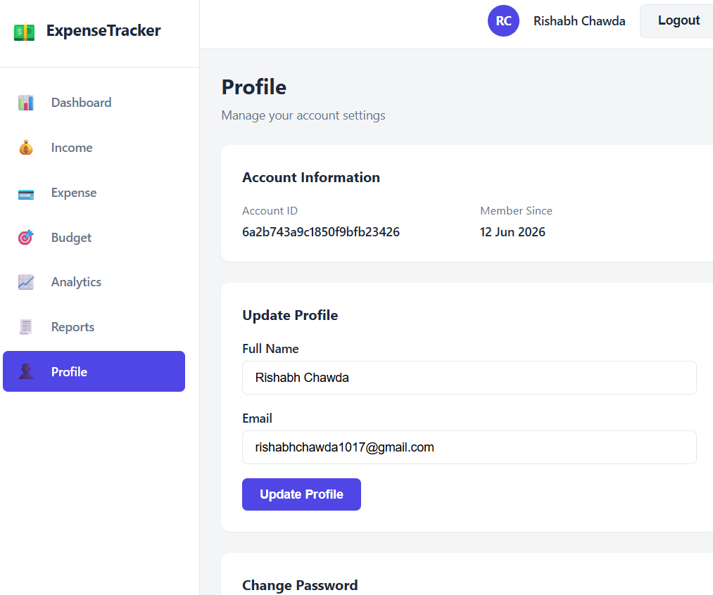

# Smart Expense Tracker & Budget Management System

A full-stack MERN application for managing personal income, expenses, budgets, and financial analytics — built as a portfolio project demonstrating production-grade patterns.


---

## Features

- **Authentication** — JWT-based register/login, protected routes, profile management, password change
- **Income & Expense Tracking** — Add, edit, delete, categorize transactions
- **Budget Management** — Set monthly budgets with real-time consumption tracking and status alerts (safe/warning/critical/exceeded)
- **Analytics Dashboard** — Interactive charts (Bar, Pie, Line) showing income vs expense trends and category-wise spending
- **Search, Filter & Sort** — Filter expenses by category, sort by date/amount
- **Reports** — Export financial data as CSV or PDF
- **Responsive Design** — Fully functional on desktop, tablet, and mobile

---

## Tech Stack

**Frontend**
- React.js (Vite)
- React Router DOM
- Axios
- Context API
- Chart.js (react-chartjs-2)
- jsPDF (PDF export)
- Pure CSS (no UI frameworks)

**Backend**
- Node.js + Express.js
- MongoDB + Mongoose
- JWT Authentication
- bcryptjs (password hashing)

---

## Project Structure

```
smart-expense-tracker/
├── backend/
│   ├── config/          # Database connection
│   ├── controllers/      # Business logic
│   ├── middlewares/       # Auth, error handling
│   ├── models/            # Mongoose schemas
│   ├── routes/            # API endpoints
│   ├── utils/             # Helper functions
│   └── server.js
│
└── frontend/
    └── src/
        ├── api/            # Axios configuration
        ├── components/      # Reusable UI components
        ├── context/          # Auth Context (global state)
        ├── pages/            # Route-level pages
        ├── utils/            # Formatters, export helpers
        └── App.jsx
```

---

## Getting Started

### Prerequisites
- Node.js (v18+)
- MongoDB (local or Atlas)

### Backend Setup

```bash
cd backend
npm install
```

Create a `.env` file (copy from `.env.example`):

```env
PORT=5000
MONGO_URI=your_mongodb_connection_string
JWT_SECRET=your_secret_key
NODE_ENV=development
```

Run the server:
```bash
npm run dev
```

### Frontend Setup

```bash
cd frontend
npm install
npm run dev
```

App runs at `http://localhost:5173`

---

## API Endpoints

### Auth
| Method | Endpoint | Description | Access |
|---|---|---|---|
| POST | `/api/auth/register` | Register new user | Public |
| POST | `/api/auth/login` | Login user | Public |
| GET | `/api/auth/profile` | Get user profile | Private |
| PUT | `/api/auth/profile` | Update profile | Private |
| PUT | `/api/auth/change-password` | Change password | Private |

### Income
| Method | Endpoint | Description | Access |
|---|---|---|---|
| GET | `/api/income` | Get all incomes | Private |
| POST | `/api/income` | Add income | Private |
| GET | `/api/income/summary` | Get income summary | Private |
| PUT | `/api/income/:id` | Update income | Private |
| DELETE | `/api/income/:id` | Delete income | Private |

### Expense
| Method | Endpoint | Description | Access |
|---|---|---|---|
| GET | `/api/expense` | Get all expenses (supports `?category=` and `?sort=`) | Private |
| POST | `/api/expense` | Add expense | Private |
| GET | `/api/expense/summary` | Get expense summary + category breakdown | Private |
| PUT | `/api/expense/:id` | Update expense | Private |
| DELETE | `/api/expense/:id` | Delete expense | Private |

### Budget
| Method | Endpoint | Description | Access |
|---|---|---|---|
| GET | `/api/budget` | Get all budgets | Private |
| POST | `/api/budget` | Set monthly budget | Private |
| GET | `/api/budget/:month` | Get budget with consumption (format: YYYY-MM) | Private |
| PUT | `/api/budget/:id` | Update budget | Private |
| DELETE | `/api/budget/:id` | Delete budget | Private |

---

## Screenshots

## Screenshots

### Login / Register



### Dashboard


### Income


### Expense


### Budget


### Analytics


### Reports


### Profile


---

## Future Improvements

- Recurring transactions (subscriptions, EMIs)
- Multi-currency support
- Email notifications for budget alerts
- Dark mode
- Pagination for large transaction lists

---

